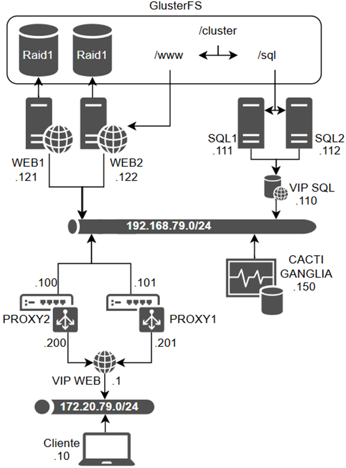

Critical Systems Infrastructure Project

Overview

This project demonstrates the configuration and implementation of critical systems infrastructure with an emphasis on redundancy, high availability, scalability, and monitoring. The environment includes web servers, SQL servers, load balancers, and monitoring tools, implemented using virtualization and automation.

Objectives

Build a resilient and efficient infrastructure aligned with industry best practices.

Ensure redundancy and high availability using technologies like RAID1, GlusterFS, and HAProxy.

Implement monitoring with tools such as Cacti and Ganglia.

Architecture

Technologies Used

Virtualization: Virtualized machines running Ubuntu 18.

File System and Storage: RAID1, GlusterFS.

Web Server: Nginx.

SQL Database: MariaDB with Pacemaker and Corosync.

Load Balancing: HAProxy.

Monitoring Tools: Cacti, Ganglia.

Automation: Shell scripts for configuration and deployment via Vagrant.

Infrastructure Components

1. Web Servers

Two virtual machines configured with RAID1 and GlusterFS.

Nginx: Hosts a company website stored on a GlusterFS volume.

2. SQL Servers

Two MariaDB servers with database files stored on a shared GlusterFS volume.

Pacemaker and Corosync: Manage high availability for the database service.

Virtual IP (VIP): Ensures seamless failover.

3. Load Balancer

Two HAProxy servers configured for active/passive load balancing.

VIP: Routes HTTP requests to the web servers.

4. Monitoring

Cacti: Provides SNMP-based infrastructure monitoring.

Ganglia: Visualizes server metrics and cluster status.

Scripts and Automation

RAID1 Configuration: install_raid.sh for creating RAID1 arrays.

GlusterFS Configuration: install_glusterfs_web.sh, install_glusterfs_sql.sh.

Nginx Setup: install_nginx.sh.

Database Configuration: install_sql_mariadb.sh.

Load Balancer Setup: install_haproxy.sh.

Monitoring Tools: Setup scripts for Cacti and Ganglia.

Key Features

Redundancy: RAID1 and GlusterFS ensure data integrity and availability.

High Availability: Pacemaker and Corosync manage automatic failover for MariaDB and HAProxy.

Load Balancing: HAProxy distributes traffic across web servers.

Monitoring: SNMP-based monitoring through Cacti and performance visualization with Ganglia.

Testing and Evaluation

Stress-tested using Apache JMeter with 10 concurrent threads.

Observed system load, network traffic, and user distribution metrics.

Simulated failovers to verify redundancy and high availability.

